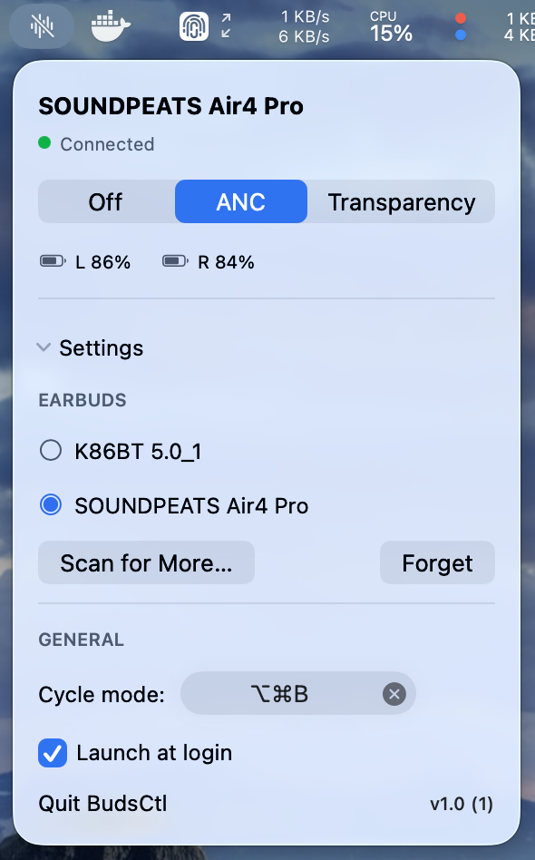

<div align="center">


# BudsCtl

### Noise-cancellation control for SoundPEATS earbuds on macOS — the AirPods menu bar experience, for buds that never got one.

macOS gives AirPods a proper noise-mode control in the menu bar. Everyone else gets
the touch gesture on the bud: tap and hold, guess which mode you landed on, try again.
BudsCtl puts **Off · Noise Cancellation · Transparency** in your menu bar, in Control
Center, in Shortcuts, and on a global hotkey — with battery for each bud.

**Apple Silicon · macOS 26+ · lives in the menu bar**

[](../../releases)

<br>



</div>

---

> **Tested with SoundPEATS Air4 Pro only.** That is the one device I own. The earbuds
> speak Qualcomm's GAIA V2 protocol, which many SoundPEATS models share, so others may
> work as-is — but nothing else has been verified. If you try one, please
> [open an issue](../../issues) either way.

## ✨ Features

- **🎧 The three modes, one click** — Off, Noise Cancellation and Transparency as a
  segmented picker in the menu bar, showing what the buds are *actually* set to, not
  what BudsCtl last asked for.
- **⌨️ Global hotkey** — ⌥⌘N cycles modes from anywhere, without taking your hands off
  the keyboard or touching the buds. Rebindable.
- **🎛️ Control Center tile** — add "Earbuds Noise Mode" to Control Center and tap to
  cycle. Reads cached state, so it never has to wait for Bluetooth.
- **⚡ Shortcuts and automations** — *Set Noise Mode*, *Cycle Noise Mode*, *Get Noise
  Mode* and *Get Earbud Battery* as App Intents. Switch to ANC when a meeting starts,
  or to Transparency when you unlock the Mac.
- **🔋 Per-bud battery** — left and right levels in the panel, refreshed while connected.
- **🔒 Private, and quiet** — one Bluetooth connection to your own earbuds. No network
  access, no telemetry, no account. Menu bar only: no Dock icon, no window.

## Install

### Manual

1. Download **`BudsCtl-1.1.dmg`** from the [latest release](../../releases/latest).
2. Open it and drag **BudsCtl** into **Applications**.
3. Launch BudsCtl — an ear icon appears in your menu bar.

> **⚠️ Not yet notarized.** Releases are signed, but with a development certificate, so
> Gatekeeper will refuse to open the app on a Mac that isn't mine. Until that changes,
> either build from source (below) or clear the quarantine flag yourself:
>
> ```sh
> xattr -dr com.apple.quarantine /Applications/BudsCtl.app
> ```
>
> Only do that for software you're willing to trust — which is a good argument for
> building it yourself.

## Getting started

1. Pair your earbuds with the Mac in **System Settings ▸ Bluetooth**, as usual. BudsCtl
   controls buds macOS is already connected to; it doesn't replace pairing.
2. Click the menu bar icon, open **Settings** at the bottom of the panel, and pick your
   earbuds from the list. Connected devices appear without any scan — if yours doesn't,
   take a bud out of the case and hit **Scan for More…**.
3. Grant **Bluetooth** access when macOS asks. Without it CoreBluetooth is denied,
   sometimes silently.
4. Turn on **Launch at login** so the menu bar control is simply always there.

That's it — the picker now follows your buds, and ⌥⌘N cycles modes from anywhere.

## Four ways to switch

| | How |
| --- | --- |
| **Menu bar** | Click the icon, click a mode. Shows current mode and battery. |
| **Hotkey** | ⌥⌘N cycles Off → ANC → Transparency. Rebind it in Settings. |
| **Control Center** | Edit Control Center, add **Earbuds Noise Mode**, tap to cycle. |
| **Shortcuts** | Four intents, usable in Shortcuts, Focus filters and automations. |

Control Center and Shortcuts work even when the app isn't running — the request is
queued and BudsCtl launches to apply it.

## How it works (in plain terms)

There is no public API for this. The earbuds speak **GAIA V2** — Qualcomm's control
protocol — over Bluetooth LE, so the protocol here was reverse engineered from the
traffic to a device I own: read the mode, set the mode, read each battery, read the
firmware version. BudsCtl holds one BLE connection, keeps a small snapshot of what the
buds reported, and hands that snapshot to Control Center and Shortcuts so they never
have to open a connection of their own.

The awkward part isn't sending commands, it's *trusting* what comes back. The buds
don't answer reliably in the first moments after connecting, and they don't announce it
when they later settle into their saved mode. So BudsCtl re-reads a few times over the
first minute and says **"Reading mode…"** rather than showing you a guess.

---

## Under the hood

- **Protocol** — GAIA V2 framed as `<vendor 00 0A> <command:2> <payload…>`, replies with
  the command's high bit set plus a status byte
  ([`GaiaFrame`](Sources/BudsKit/GaiaFrame.swift)). Only the `0x03xx` command group is
  even *named* in this codebase — `0x01xx`/`0x02xx` contain device reset and power off,
  and this app has no reason to know them. Verified against firmware
  `AIR4PRO-BS588R2E_20241112_v0.2.1`. The status byte is advisory: this firmware answers
  `0x01` for merely unsupported commands, so state is always confirmed by reading, never
  inferred from an ack.
- **Transport** — CoreBluetooth against the GAIA service `00001100-D102-11E1-…`, write to
  the command characteristic, notifications on the response one
  ([`GaiaClient`](Sources/BudsKit/GaiaClient.swift),
  [`GaiaTransport`](Sources/BudsKit/GaiaTransport.swift)).
- **Mode settling** — the reading taken as the link comes up is the least trustworthy one
  there is: it times out, or reports *Off* whatever the buds are really doing, and the
  buds then say nothing when they settle (measured at 33 s of silence after a case-exit
  connect). So [`DeviceController`](Sources/BudsKit/DeviceController.swift) re-reads at
  2, 5, 10, 20 and 45 s after connecting and stops the instant you set a mode yourself.
  Five reads per connection — bounded, not polling.
- **Optimistic UI, honest UI** — a set shows immediately as `pendingMode` during the
  device's ~1.4 s apply window, but `mode` only ever holds what the device confirmed
  ([`DeviceState`](Sources/BudsKit/DeviceState.swift)). While the mode is unknown the
  panel spins instead of presenting a guess as a selection. The Control Center button
  repaints on the optimistic value too, so a tap is not silent for 1.4 s; the snapshot
  carries a `pending` flag so `SetModeIntent` still only reports success on a confirmed
  mode.
- **One connection, three front ends** — the app is the only process that touches
  CoreBluetooth. The Control Center extension and the Shortcuts intents talk to it
  through [`StateBridge`](Sources/BudsKit/StateBridge.swift): a snapshot the agent writes
  and they read, a request they write and it drains, both in App Group defaults, nudged by
  a payload-free Darwin notification. Requests carry a monotonic `seq` in the *same*
  stored value as the payload — two keys meant a second process could read a fresh
  payload beside a stale seq and apply one Control Center tap twice.
- **Cold start** — if nothing picks a request up within 2 s the agent isn't running, so
  the intent calls `continueInForeground()` to launch it. The agent drains pending
  requests on start, so the original request still lands and is never re-posted
  ([`Intents`](Sources/BudsKit/Intents.swift)).
- **Only one Control Center control** — macOS 26.5 has no `ControlWidgetBundle`, and
  `ControlWidgetConfigurationBuilder` takes a single configuration, so per-mode direct
  controls can't be built in one extension. Hence one cycle button
  ([`Controls.swift`](Controls/Controls.swift)).

### Build from source

```sh
brew install xcodegen
xcodegen generate
xcodebuild -project BudsCtl.xcodeproj -scheme BudsCtl -configuration Debug \
  -derivedDataPath .build/xcode build
cp -R .build/xcode/Build/Products/Debug/BudsCtl.app /Applications/
open /Applications/BudsCtl.app
```

`project.yml` is the source of truth; `BudsCtl.xcodeproj`, `App/Info.plist` and
`Controls/Info.plist` are build artifacts and are not committed.

### Test

```sh
swift test                       # 76 tests, no hardware needed
swift run budsctl-cli status     # against real hardware
```

The BLE layer was proven with the CLI before any UI existed, and it's still the fastest
way to see what the buds are doing:

```
budsctl-cli discover           scan for earbuds and save the chosen one
budsctl-cli status             connect and print mode, battery, firmware
budsctl-cli set <mode>         normal | anc | passthrough
budsctl-cli watch              print every frame the device sends, until Ctrl-C
```

`docs/superpowers/manual-checklist.md` covers what tests cannot.

### Packaging

```sh
./Tools/makedmg.sh             # Release build → BudsCtl-<version>.dmg
```

`hdiutil` ships with macOS, so there's nothing to install. The script signs nothing of
its own — the app carries whatever identity built it, which is why current releases are
development-signed rather than notarized.

### Tuning

- [`DeviceController.swift`](Sources/BudsKit/DeviceController.swift) — `settleReads`
  (when to re-read the mode after connecting), `setTimeout`, `batteryInterval`.
- [`ANCMode.swift`](Sources/BudsKit/ANCMode.swift) — `next` (the cycle order used by the
  hotkey and the Control Center button), labels, SF Symbols.
- [`BudsCtlApp.swift`](App/BudsCtlApp.swift) — the default hotkey (⌥⌘N).

### Limitations

- **One device family, verified.** Only SoundPEATS Air4 Pro on firmware v0.2.1 has been
  tested. Other GAIA devices may work; expect nothing.
- **Not notarized**, so Gatekeeper blocks the released DMG. See the install note.
- **macOS 26+ and Apple Silicon.** The project targets macOS 26 with Swift 6 strict
  concurrency; there's no back-deployment.
- **One Control Center control**, for the SDK reason above — cycle, not three buttons.
- **Reverse engineered, not documented.** GAIA V2 is Qualcomm's, undocumented publicly,
  and derived here from traffic to my own device. A firmware update could change it.
- **Mode changes made from your phone** aren't announced by the buds; BudsCtl picks them
  up on wake and during the settle window, not instantly.

## Credits & license

Global hotkey handling uses [KeyboardShortcuts](https://github.com/sindresorhus/KeyboardShortcuts)
by Sindre Sorhus (MIT).

BudsCtl is not affiliated with, endorsed by, or supported by SoundPEATS or Qualcomm.
GAIA is Qualcomm's protocol; the implementation here was written for interoperability
with a device the author owns.
